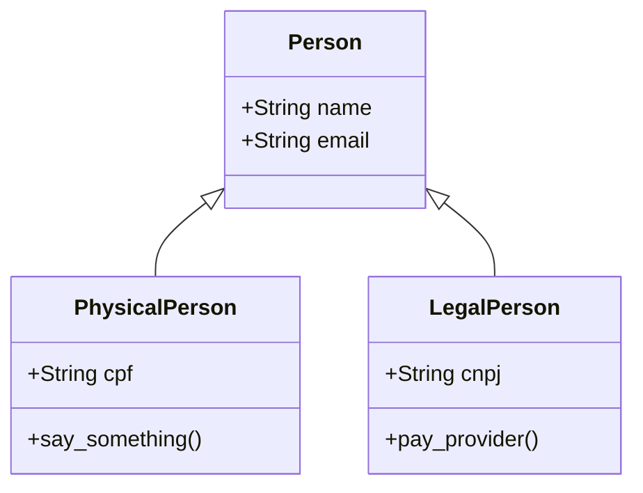

## Class diagram with Mermaid to the [exercise11.rb](Udemy/modulo_02/exercise11.rb) below

```mermaid
classDiagram
    Person <|-- PhysicalPerson
    Person <|-- LegalPerson
    Person : +String name
    Person : +String email
    
    class PhysicalPerson{
        +String cpf
        +say_something()
    }
    class LegalPerson{
        +String cnpj
        +pay_provider()
    }
```